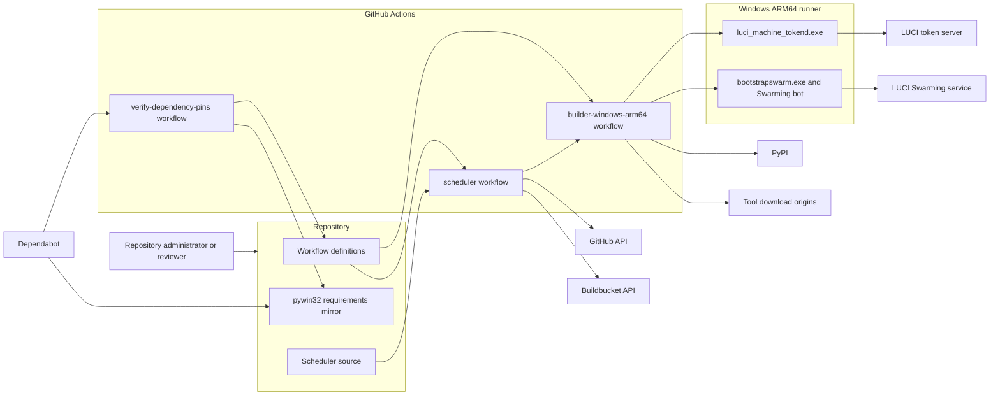

# Security Design Report

This document records the security decisions behind `gobuilder`, especially the GitHub Actions workflows that provision a Windows ARM64 LUCI Swarming bot.

The central security goal is to let a GitHub-hosted Windows ARM64 runner temporarily join LUCI as a Go builder without giving that runner more repository, credential, or network authority than it needs.

## Scope

Covered components:

- `.github/workflows/builder-windows-arm64.yml`
- `.github/workflows/scheduler.yml`
- `.github/workflows/verify-dependency-pins.yml`
- `.github/dependabot.yml`
- `.github/requirements-builder-windows-arm64.txt`
- `cmd/scheduler`
- `internal/buildbucket`
- `internal/githubactions`
- `internal/scheduler`

Out of scope:

- LUCI service internals.
- GitHub-hosted runner platform internals.
- Go project builder policy outside this repository.
- The contents served by LUCI after `bootstrapswarm.exe` starts the Swarming bot.

## Assets

The main assets and security properties are:

- `LUCI_BOT_KEY_PEM`, the private key used to mint a LUCI machine token. This needs confidentiality and integrity protection.
- `token.json`, the LUCI machine token generated during the builder workflow. This needs confidentiality protection for its lifetime.
- The repository and its workflows.
- The GitHub Actions token used by the scheduler to dispatch builder runs.

## Trust Boundaries

The design treats these boundaries as security-relevant:

- GitHub Actions control plane to workflow job runtime.
- Repository contents to the secret-bearing builder job.
- Scheduler job to builder job.
- GitHub APIs to local scheduler code.
- Buildbucket API to local scheduler code.
- Downloaded third-party artifacts to the runner.
- LUCI token minting to the Swarming bot process.
- GitHub Dependabot metadata to the actual builder workflow runtime.

## Actor Diagram

## Design Principles

The implementation follows these principles:

- Keep the secret-bearing builder workflow independent from repository checkout.
- Grant each workflow only the GitHub token permissions it needs.
- Pin executable workflow dependencies.
- Verify mutable external downloads before executing them.
- Keep automation update discovery separate from credentialed runtime behavior.

## Decisions

### 1. The builder workflow has no repository token permissions

Decision: `builder-windows-arm64` declares `permissions: {}`.

Rationale: this workflow handles LUCI credentials and starts the Swarming bot. It should not receive a repository-scoped `GITHUB_TOKEN` unless it has a concrete need for one.

Security effect: a compromised builder step should not be able to push code, create releases, open issues, update pull requests, or read private repository contents through the default token.

Residual risk: the workflow still runs on GitHub-hosted infrastructure and receives LUCI credentials through Actions variables and secrets. GitHub Actions itself remains trusted infrastructure.

### 2. The builder workflow does not check out the repository

Decision: `builder-windows-arm64` does not use `actions/checkout`.

Rationale: repository checkout would expose repository contents to the same job that handles LUCI credentials. The builder does not need repository files to install tools, mint the LUCI token, or start `bootstrapswarm.exe`.

Security effect: pull-request-controlled repository content cannot directly influence the secret-bearing builder runtime through checked-out scripts or files.

Residual risk: the workflow definition itself is still repository code. Changes to the workflow must be reviewed with the same care as code that handles credentials.

### 3. The scheduler has only the permissions required to dispatch builders

Decision: `scheduler` grants `contents: read` and `actions: write`.

Rationale: `contents: read` is required to check out and build the scheduler source. `actions: write` is required to dispatch the builder workflow. No broader repository permission is needed.

Security effect: the scheduler can start builder workflows, but it is not granted broad write access to repository contents.

Residual risk: `actions: write` is powerful inside the repository because it can dispatch workflows. The scheduler workflow is therefore kept small, pinned, and protected by input validation.

### 4. Checkout credentials are not persisted

Decision: workflows using `actions/checkout` set `persist-credentials: false`.

Rationale: the checked-out Git config should not retain a token after checkout. Later commands should not accidentally gain Git push or fetch authority through stored credentials.

Security effect: reduces token exposure to later build steps and subprocesses.

Residual risk: the job still has the token available through the Actions runtime while permissions are granted.

### 5. Marketplace actions are pinned to commit SHAs

Decision: external marketplace actions are referenced by full commit SHA instead of mutable tags.

Pinned actions include:

- `actions/checkout`
- `actions/setup-go`
- `actions/cache`

Rationale: tags can move. A commit SHA identifies the exact action code reviewed at the time of pinning.

Security effect: reduces the chance that a compromised or retagged marketplace action changes behavior without a repository diff.

Residual risk: the pinned commit can still contain a vulnerability, and future security fixes require manually updating the SHA.

### 6. Non-marketplace executable downloads are SHA-256 verified

Decision: the builder workflow creates a local `Save-VerifiedDownload.ps1` helper and verifies SHA-256 before using downloaded artifacts.

Verified artifacts include:

- `llvm-mingw`
- `luci_machine_tokend.exe`
- `bootstrapswarm.exe`

Rationale: these artifacts are downloaded at runtime and may be executable or affect execution. The workflow should detect unexpected changes before running or extracting them.

Security effect: protects against accidental upstream replacement, CDN corruption, and simple artifact substitution.

Residual risk: if a malicious artifact hash is committed to the workflow, the check will faithfully verify the malicious artifact. Hash updates need code review.

### 7. `pywin32` is pinned without making the builder read repository files

Decision: `pywin32` is installed as `pywin32==$PYWIN32_VERSION` with `--only-binary=:all:`. `.github/requirements-builder-windows-arm64.txt` mirrors that pin only so Dependabot can discover updates. The builder workflow still uses `PYWIN32_VERSION` directly and does not read the requirements file. `verify-dependency-pins` runs on Dependabot pull requests and fails when the mirrored requirements pin and `PYWIN32_VERSION` disagree.

Rationale: `bootstrapswarm.exe` needs Python Windows integration. Pinning gives reproducible dependency selection, and wheel-only installation avoids arbitrary source build steps during the builder workflow. Dependabot understands requirements files, but the secret-bearing builder workflow should not check out the repository just to read a dependency pin. The sync check forces the workflow pin update to be an intentional reviewer-visible change.

Security effect: avoids opportunistic upgrades, avoids running package build scripts from an sdist, and keeps dependency update discovery separate from the credentialed builder runtime.

Residual risk: the workflow does not currently enforce a wheel hash for `pywin32`. The design trusts PyPI wheel distribution for the pinned version. The requirements file is metadata, not runtime configuration, and the sync check currently targets Dependabot PRs rather than every human-authored PR.

### 8. LUCI private key material is short-lived on disk

Decision: the builder workflow writes `LUCI_BOT_CERT_PEM` and `LUCI_BOT_KEY_PEM` into temporary PEM files only for the `luci_machine_tokend.exe` invocation, then deletes them in a `finally` block.

Rationale: `luci_machine_tokend.exe` expects PEM files, but the private key should not remain on disk longer than necessary. The public certificate is handled together with the key for the token minting step, but it is not treated as a protected asset.

Security effect: reduces the post-mint exposure window for raw private key material.

Residual risk: the key still exists in the job environment and temporary files during the minting step. A malicious command in the same step could read it.

### 9. The Swarming bot receives only the minted LUCI machine token path

Decision: `bootstrapswarm.exe` runs with `LUCI_MACHINE_TOKEN` pointing to `token.json`; the PEM files are deleted before `bootstrapswarm.exe` starts.

Rationale: the Swarming bot needs the machine token, not the original private key.

Security effect: a running Swarming bot process is not handed the long-lived private key.

Residual risk: `token.json` is still a sensitive bearer credential for the lifetime of the bot process.

### 10. The Swarming bot runs as a dedicated local user

Decision: the workflow creates or updates a local `swarming` user, assigns a generated password, masks it in logs, and starts `bootstrapswarm.exe` using that credential.

Rationale: this matches the expected LUCI builder shape more closely than running the bot directly as the default Actions user.

Security effect: gives the bot a predictable profile, home directory, temp directory, and working directory while avoiding reuse of the default runner account state.

Residual risk: the `swarming` user is added to Administrators to match builder expectations. This is not a sandbox boundary against malicious build payloads.

### 11. API requests are constrained before they leave the scheduler

Decision: scheduler API inputs are validated and encoded before request construction. Workflow identifiers must be non-empty, at most 128 characters, and contain only letters, digits, `.`, `_`, or `-`. GitHub API and Buildbucket base URLs must use `http` or `https`, include a host, and omit user info, query strings, and fragments. Repository owner/name and workflow identifiers are path-escaped, query strings are built with `url.Values`, and request bodies are JSON encoded.

Rationale: the scheduler builds outbound GitHub and Buildbucket requests from workflow inputs and configuration. Constraining identifiers, base URLs, paths, query parameters, and bodies keeps those values from changing request structure or smuggling credentials and parameters through base URLs.

Security effect: reduces malformed request, path injection, query injection, credential-in-URL, and unexpected destination risk.

Residual risk: the validators are intentionally narrow. If GitHub later supports required workflow identifier characters outside this set, this code will need a deliberate update. `http` remains allowed for local testing or controlled non-production environments; production workflows use GitHub's provided HTTPS API URL and the default HTTPS Buildbucket URL.

### 12. API response handling is bounded

Decision: GitHub error bodies are limited when read, Buildbucket response bodies are capped, GitHub workflow run pagination is capped, and repeated Buildbucket page tokens are rejected.

Rationale: remote APIs should not be able to force unbounded memory use or infinite loops.

Security effect: limits denial-of-service impact from unexpected API responses.

Residual risk: normal large queues can still make scheduler execution slower up to the configured bounds.

### 13. Step timeouts bound long-running workflow phases

Decision: workflows use step-level `timeout-minutes`, including a 60-minute timeout around `Register LUCI builder`.

Rationale: a hosted runner should not hang indefinitely while downloading tools, minting tokens, or running the Swarming bot.

Security effect: limits the exposure window for credentials and runner resources during stuck states.

Residual risk: the Swarming bot can still run for up to the configured step timeout once registered.

## Dependency Update Procedure

When updating `llvm-mingw`:

- Update `LLVM_MINGW_VERSION`.
- Update `LLVM_MINGW_SHA256` to the SHA-256 of the exact archive used by the workflow.
- Review the upstream release source before changing the hash.

When updating LUCI builder tools:

- Update `LUCI_MACHINE_TOKEND_SHA256` or `BOOTSTRAPSWARM_SHA256`.
- Verify the hash against the exact `go-builder-data` object downloaded by the workflow.
- Treat hash-only updates as security-sensitive changes.

When updating `pywin32`:

- Update `.github/requirements-builder-windows-arm64.txt`.
- Update `PYWIN32_VERSION` in `.github/workflows/builder-windows-arm64.yml`.
- Let `verify-dependency-pins` confirm that both pins match.

When updating marketplace actions:

- Update the commit SHA.
- Keep the version comment next to the SHA accurate.
- Review upstream release notes and security advisories.

## Operational Expectations

Repository administrators should treat changes to workflows, pinned hashes, scheduler dispatch logic, and LUCI credential handling as security-sensitive.

## Known Residual Risks

- GitHub-hosted runners and GitHub Actions are trusted infrastructure for this design.
- LUCI services and downloaded LUCI bootstrap tools are trusted once their expected hashes are accepted into the repository.
- The `swarming` user is an administrator, so it is an execution identity boundary, not a privilege sandbox.
- `pywin32` is not hash-pinned today; it is version-pinned and wheel-only.
- Dependabot pin synchronization is enforced for Dependabot PRs, not every human-authored PR.
- The 60-minute registration timeout bounds execution but is not an idle detector.

## Future Hardening Options

These are not implemented today, but they are reasonable next steps if the threat model tightens:

- Run the `pywin32` pin synchronization check for all pull requests that touch either pin.
- Add hash checking for the exact `pywin32` wheel if the workflow can do so without requiring repository checkout in the builder job.
- Add branch protection rules requiring the scheduler, builder, and dependency-pin checks before merging workflow changes.
- Move LUCI credential access into a protected GitHub environment with required reviewers.
- Add scheduled validation that pinned external URLs still resolve to the expected hashes.